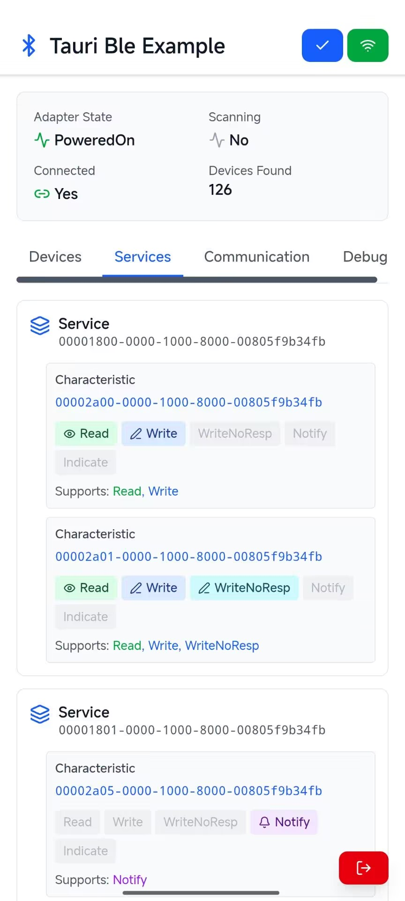

# Tauri BLE Example - Developer Quick Start Guide

**[中文版本](README.md)** | **English**

## 🎯 Project Overview

This is a cross-platform Bluetooth Low Energy (BLE) application example based on **Tauri + Vue 3 + TypeScript**. It supports Bluetooth device communication on Windows, macOS, Linux, and Android platforms.



## 📋 Prerequisites

| Component | Version | Description |
|-----------|---------|-------------|
| Node.js | ≥ 18.0 | JavaScript runtime |
| Rust | Latest Stable | Backend development language |
| Tauri CLI | ≥ 2.0 | Tauri command-line tool |
| Android SDK | API 21+ | Android development only |
| JDK | 11+ | Android development only |

---

## 🚀 Quick Start (5 Minutes)

### 1️⃣ Clone the Project

```bash
git clone https://github.com/your-repo/tauri-ble-example.git
cd tauri-ble-example
```

### 2️⃣ Configure Node.js Environment

```powershell
# Check Node.js version
node --version
npm --version

# If not installed, download from https://nodejs.org/
# Recommended: Use NVM for version management, download from https://github.com/coreybutler/nvm-windows
nvm install latest
nvm use latest
```

### 3️⃣ Configure Rust Environment

```powershell
# Install Rust using rustup (recommended)
# Visit https://rustup.rs/ or execute
irm https://rustup.rs | iex

# Verify installation
rustc --version
cargo --version

# Update Rust (recommended weekly)
rustup update
```

### 4️⃣ Install Tauri CLI

```powershell
# Install Tauri CLI globally
cargo install tauri-cli

# Verify installation
cargo tauri --version
```

### 5️⃣ Install Project Dependencies

```powershell
# Install npm dependencies
npm install
```

### 6️⃣ Development & Debugging

```powershell
# Run Tauri application in development mode
cargo tauri dev
```

> The application will run in development mode with hot reload support

---

## 🏗️ Build & Package

### Local Development Build

```powershell
# Build frontend only
npm run build

# Build desktop application
cargo tauri build
```

Build output locations:

- Windows: `src-tauri/target/release/`
- macOS: `src-tauri/target/release/`

### 🤖 Android Build Guide

#### Step 1: Configure Android Development Environment

```powershell
# Install JDK 11+ (recommended)
# Download from https://www.oracle.com/java/technologies/downloads/
# Or use
choco install openjdk

# Verify
java -version
```

#### Step 2: Install Android SDK

```powershell
# Download Android Studio
# https://developer.android.com/studio

# Or use command-line tools (cmdline-tools)
# Set ANDROID_SDK_ROOT environment variable
[Environment]::SetEnvironmentVariable("ANDROID_SDK_ROOT", "C:\Users\YourUsername\AppData\Local\Android\Sdk", [EnvironmentVariableTarget]::User)
[Environment]::SetEnvironmentVariable("ANDROID_HOME", "C:\Users\YourUsername\AppData\Local\Android\Sdk", [EnvironmentVariableTarget]::User)

# Refresh environment variables
$env:ANDROID_SDK_ROOT = [System.Environment]::GetEnvironmentVariable("ANDROID_SDK_ROOT","User")
$env:ANDROID_HOME = [System.Environment]::GetEnvironmentVariable("ANDROID_HOME","User")

# Verify
echo $env:ANDROID_SDK_ROOT
```

#### Step 3: Install Android Toolchain

```powershell
# Add Android compilation targets
rustup target add aarch64-linux-android
rustup target add armv7-linux-androideabi
rustup target add x86_64-linux-android
rustup target add i686-linux-android

# List installed targets
rustup target list | findstr "installed"
```

#### Step 4: Generate Application Signing Key

> ⚠️ **Security Note**: Application signing keys are critical. Store them securely!

**Create a Keystore for first-time build:**

```powershell
# Generate keystore using keytool (requires JDK)
keytool -genkey -v -keystore tauri-ble-example-keystore.jks -keyalg RSA -keysize 2048 -validity 10000 -alias upload

# Follow the prompts to enter:
# - Keystore password
# - Key password
# - Country code, city, and other information
```

**Create `local.properties` file:**

Create `local.properties` in the `src-tauri/gen/android/` directory with the following content:

```properties
# Signing configuration (replace with your actual values)
storePassword=your_keystore_password
keyPassword=your_key_password
keyAlias=upload
storeFile=C:\\path\\to\\your\\tauri-ble-example-keystore.jks
```

**Value descriptions:**

- `your_keystore_password`: Password set when creating the keystore
- `your_key_password`: Password set when creating the key
- `C:\\path\\to\\your\\tauri-ble-example-keystore.jks`: Full path to the keystore file

#### Step 5: Build Android APK

```powershell
# Build APK (with signature)
cargo tauri android build
```

APK location: `src-tauri/gen/android/app/build/outputs/apk/`

---

## 🔐 Security & Key Management

### ⚠️ Important Warnings

1. **Never leak key information**:
   - 🚫 Do NOT commit `local.properties` to Git repository
   - 🚫 Do NOT upload keystore files (`.jks`) to public repositories
   - 🚫 Do NOT expose keys in code comments or documentation
   - 🚫 Do NOT share your signing passwords with anyone

2. **Keystore Loss Handling**:
   - If the keystore is lost or compromised, you must generate a new signing key for your app
   - You cannot re-sign previously released apps with a new key
   - Recommended to maintain backups in a secure location

3. **Environment Variables Approach** (Recommended):

```powershell
# Set environment variables instead of hardcoding in files
[Environment]::SetEnvironmentVariable("KEYSTORE_PASSWORD", "your_password", [EnvironmentVariableTarget]::User)
[Environment]::SetEnvironmentVariable("KEY_PASSWORD", "your_password", [EnvironmentVariableTarget]::User)
[Environment]::SetEnvironmentVariable("KEYSTORE_PATH", "C:\path\to\keystore.jks", [EnvironmentVariableTarget]::User)

# Verify
$env:KEYSTORE_PASSWORD
```

### Git Security Configuration

**Add the following lines to `.gitignore` (if not already added):**

```gitignore
# Android local configuration
src-tauri/gen/android/local.properties

# Keystore files
*.jks
*.keystore

# Gradle files
src-tauri/gen/android/.gradle/
src-tauri/gen/android/build/

# IDE configuration
.idea/
*.iml
```

### CI/CD Key Protection

Use GitHub Secrets or similar key management services to protect keys in CI/CD workflows

---

## 📦 Project Structure

```bash
tauri-ble-example/
├── src/                          # Vue frontend code
│   ├── App.vue                  # Main application component
│   ├── main.ts                  # Application entry point
│   └── index.css                # Style file
├── src-tauri/                   # Rust backend code
│   ├── gen/
│   │   ├── android/                # Android related files
│   │   │   ├── local.properties    # Local configuration file (should not be committed to version control)
│   │   │   ├── ...
│   ├── src/
│   │   ├── lib.rs              # Rust library file
│   │   └── main.rs             # Rust main file
│   ├── Cargo.toml              # Rust dependencies configuration
│   ├── tauri.conf.json         # Tauri configuration file
│   └── capabilities/           # Permission configuration
├── public/                      # Static assets
├── package.json                 # npm dependencies
├── tsconfig.json               # TypeScript configuration
└── vite.config.ts              # Vite configuration
```

---

## 🔧 Common Commands Reference

| Command | Description |
|---------|-------------|
| `npm run dev` | Start frontend development server |
| `npm run build` | Build frontend assets |
| `cargo tauri dev` | Run desktop application in development mode |
| `cargo tauri build` | Build and package desktop application |
| `cargo tauri android dev` | Run Android application in development mode |
| `cargo tauri android build` | Build and package Android application |

---

## 📱 Bluetooth (BLE) Features

This project integrates the **tauri-plugin-blec** plugin, providing cross-platform Bluetooth Low Energy support.

### Main Features

- 📡 Scan Bluetooth devices
- 🔗 Connect/disconnect devices
- 📨 Read/write characteristics
- 🔔 Subscribe to notifications

---

## 📚 Related Resources

- 🦀 [Rust Official Documentation](https://doc.rust-lang.org/)
- 🎨 [Vue 3 Documentation](https://vuejs.org/)
- 🚀 [Tauri Official Documentation](https://tauri.app/)
- 📱 [Tauri Mobile Documentation](https://tauri.app/v1/guides/getting-started/setup/mobile)
- 🔌 [tauri-plugin-blec](https://github.com/MnlPhlp/tauri-plugin-blec)
- 🤖 [Android Official Documentation](https://developer.android.com/docs)

---

## 💡 Development Recommendations

1. **Use VS Code**: Install recommended extensions
   - Vue - Official
   - Tauri
   - rust-analyzer
   - TypeScript Vue Plugin

2. **Debugging Tips**:
   - Frontend: Use Vue DevTools
   - Rust: Set `RUST_LOG=debug` to view logs

3. **Performance Optimization**:
   - Use `npm run build` to generate optimized production version
   - Leverage Vite's code splitting feature

4. **Version Management**:
   - Regularly run `rustup update`
   - Regularly run `npm update`

---

## 📄 License

MIT License - See LICENSE file for details
